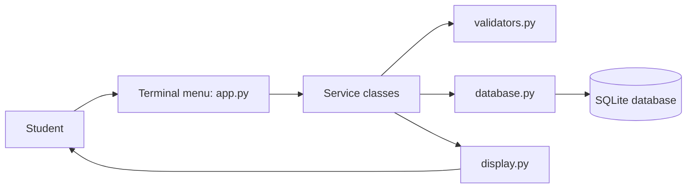
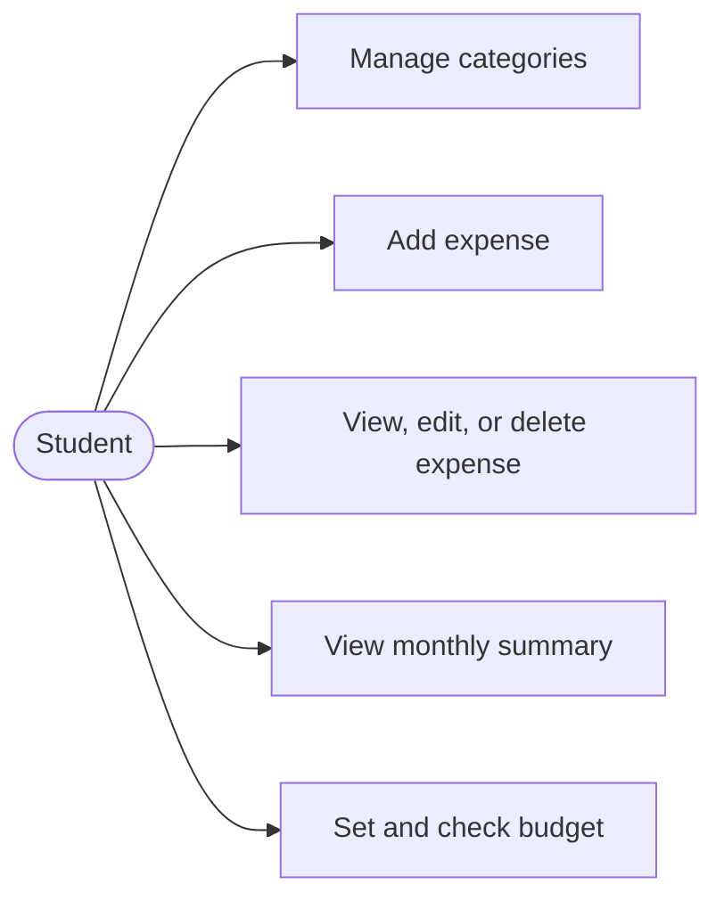
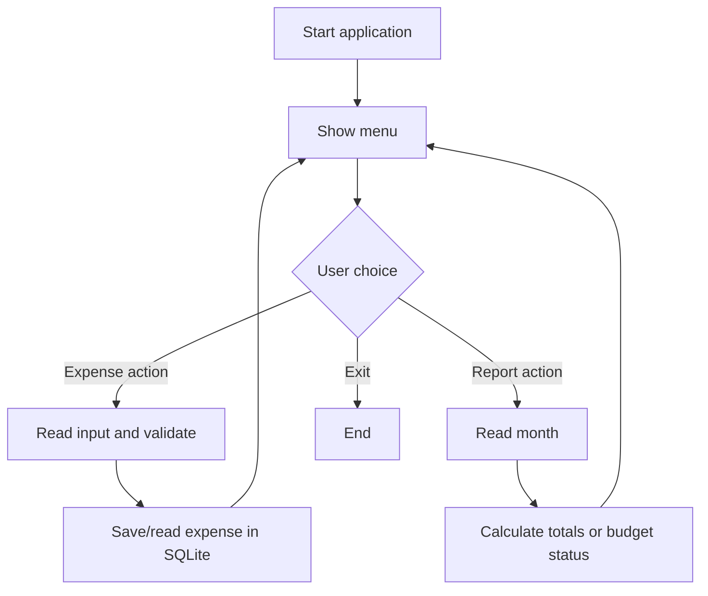
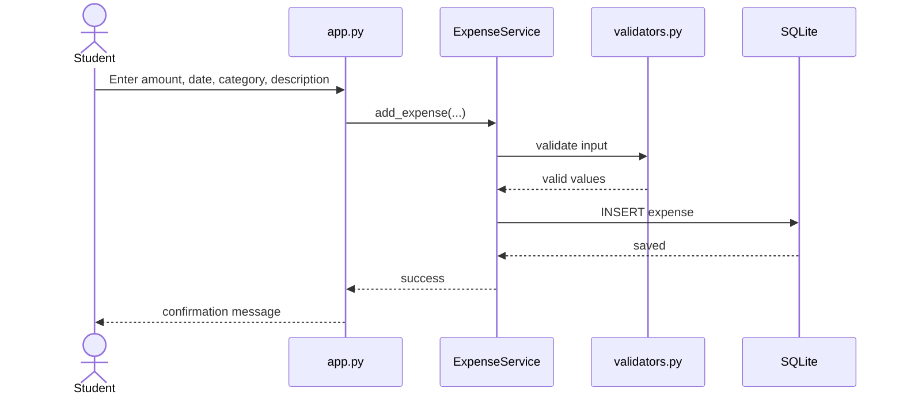
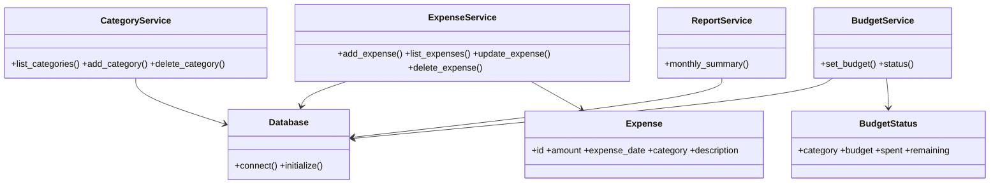

# Smart Expense Tracker — Project Report

> **Submission note:** This is the editable documentation/OCS report source. Replace bracketed details with the student's real details, insert only real screenshots in the marked places, then export it as a PDF for portal submission. It is intentionally not LaTeX.

## 1. Cover Page

**Project Title:** Smart Expense Tracker  
**Course:** [Course name and code]  
**Submitted by:** [Student name]  
**Registration number:** [Registration number]  
**Faculty:** [Faculty name]  
**Submission date:** [Date]

## 2. Introduction

Students often make frequent small purchases for food, travel, stationery, and other needs. Without a record, it is difficult to understand spending habits. Smart Expense Tracker is a simple terminal application that records these purchases and presents a clear monthly summary. It is designed to apply fundamental Python concepts such as functions, classes, lists, conditions, loops, file/database handling, and input validation to a real-world problem.

## 3. Problem Statement

Students need a straightforward method to record personal expenses, group them into categories, and compare category spending with a monthly plan. Manual notes are easily forgotten and do not automatically calculate totals. The project solves this problem using a local Python program and SQLite database.

## 4. Functional Requirements

| ID | Requirement |
| --- | --- |
| FR1 | The system shall display a menu so the user can choose an action. |
| FR2 | The user shall be able to add and list expense categories. |
| FR3 | The user shall be able to add an expense with amount, date, category, and description. |
| FR4 | The user shall be able to view all expenses or filter them by month. |
| FR5 | The user shall be able to edit or delete an expense by ID. |
| FR6 | The system shall calculate total monthly spending and category-wise monthly spending. |
| FR7 | The user shall be able to set a monthly category budget and view its status. |

The three major functional modules are category management, expense management, and reporting/budget monitoring.

## 5. Non-functional Requirements

| Area | Requirement and implementation |
| --- | --- |
| Usability | A numbered menu, short prompts, readable tables, and clear success/error messages make the program simple to use. |
| Reliability | SQLite transactions and database constraints preserve valid local records. |
| Performance | Queries work quickly for a typical student's small personal expense list. |
| Maintainability | Database, validation, business logic, display, and menu code are separated into small modules. |
| Error handling | Invalid amounts, dates, months, blank text, duplicate categories, and unknown IDs produce friendly messages instead of ending the program. |
| Resource efficiency | The project uses Python's standard library and one lightweight local SQLite file. |

## 6. System Architecture



`app.py` receives the user's choice. It calls service classes, which validate data and read/write SQLite through the `Database` class. Display helpers format returned data for the terminal.

## 7. Design Diagrams

### Use Case Diagram



### Workflow Diagram



### Sequence Diagram: Add Expense



### Class/Component Diagram



### ER Diagram and Schema Design

```mermaid
erDiagram
    CATEGORIES ||--o{ EXPENSES : classifies
    CATEGORIES ||--o{ BUDGETS : has
    CATEGORIES { int id PK \n string name UK }
    EXPENSES { int id PK \n decimal amount \n date expense_date \n int category_id FK \n string description }
    BUDGETS { int id PK \n int category_id FK \n string month \n decimal amount }
```

`categories(id, name)` stores category names. `expenses(id, amount, expense_date, category_id, description, created_at)` stores each expense. `budgets(id, category_id, month, amount)` stores one planned amount per category and month; `(category_id, month)` is unique.

## 8. Design Decisions and Rationale

- Python was selected because it matches the project requirement and is suitable for first-year programming concepts.
- A terminal interface was selected because it keeps the focus on Python logic rather than web or GUI frameworks.
- SQLite was selected because it is included with Python, requires no server, and still demonstrates structured storage and SQL.
- Separate service and validation modules make the code easier to read, test, and explain without using an unnecessarily complex architecture.

## 9. Implementation Details

| File | Responsibility |
| --- | --- |
| `app.py` | Application menu and user interaction. |
| `database.py` | Creates tables, starter categories, and SQLite connections. |
| `services.py` | Category, expense, budget, and report operations. |
| `validators.py` | Checks amounts, dates, months, and text fields. |
| `models.py` | Defines simple `Expense` and `BudgetStatus` data classes. |
| `display.py` | Prints readable terminal tables. |
| `tests/` | Automated validator and service tests. |

The database is created automatically at `data/expense_tracker.db` when `python app.py` is run. The initial categories are Food, Travel, Shopping, Bills, and Other.

## 10. Screenshots / Results

Insert genuine screenshots captured from this implementation. Do not replace these placeholders with invented images or results.

**[Screenshot placeholder 1: Main menu after `python app.py`]**

**[Screenshot placeholder 2: Successful Add Expense interaction]**

**[Screenshot placeholder 3: Monthly Summary output with real entered records]**

**[Screenshot placeholder 4: Budget Status output, preferably including an over-budget example]**

## 11. Testing Approach

Automated tests use Python's `unittest` module and a temporary SQLite database. Run them with:

```bash
python -m unittest discover -s tests -v
```

| Test area | Expected result |
| --- | --- |
| Valid input | Amount, date, month, and text are accepted and normalized. |
| Invalid input | Zero/negative/non-numeric amount, invalid date/month, and blank text raise a clear validation error. |
| Expense CRUD | An expense can be added, read, updated, and deleted. |
| Reporting | Monthly totals include stored expenses in the selected month. |
| Budget | A category with spending above its saved budget has a negative remaining value. |

## 12. Challenges Faced

- Designing a storage structure that remains understandable while linking expenses and budgets to categories.
- Handling invalid terminal input without stopping the entire application.
- Presenting database records in readable terminal tables.

## 13. Learnings and Key Takeaways

- A real problem can be divided into input, processing, storage, and output stages.
- Classes and modules improve readability when each has one clear responsibility.
- Input validation and tests are important even in a small console application.
- SQLite provides a practical introduction to relational databases, tables, keys, and SQL queries.
- Git commits document the progression of a project.

## 14. Future Enhancements

- Add a graphical interface using Tkinter.
- Export a monthly report to CSV.
- Add user accounts if the project is later converted to a multi-user application.
- Show simple charts after learning an appropriate visualization library.

## 15. References

1. Python Software Foundation, *Python 3 Documentation*: https://docs.python.org/3/
2. SQLite, *SQLite Documentation*: https://www.sqlite.org/docs.html
3. Assignment document, *VITyarthi — Build Your Own Project General Project Instructions & Submission Guidelines*.

